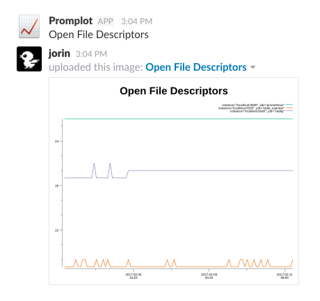

#  :chart_with_upwards_trend: promplot

[](https://godoc.org/qvl.io/promplot)
[](https://travis-ci.org/qvl/promplot)
[](https://goreportcard.com/report/qvl.io/promplot)


`promplot` is an opinionated tool to create plots from your [Prometheus](https://prometheus.io/) metrics and automatically sends them to you.


**Slack example:**

``` sh
promplot -title "Open File Descriptors" -query "process_open_fds" -range "7d" -url $promurl -slack $slacktoken -channel stats
```



Currently the only implemented transport is [Slack](https://slack.com/).
But feel free to [add a new one](#development)!


    Usage: promplot [flags...]

    Create and deliver plots from your Prometheus metrics.

    Save plot to file or send it right to a slack channel.
    One of -slack or -file must be set.


    Flags:
      -channel string
            Required when -slack is set. Slack channel to post to.
      -file string
            File to save image to. Should have same extension as specified -format. Set -file to - to write to stdout.
      -format string
            Optional. Image format. For possible values see: https://godoc.org/github.com/gonum/plot/vg/draw#NewFormattedCanvas (default "png")
      -query string
            Required. PQL query.
      -range value
            Required. Time to look back to. Format: 5d12h34m56s
      -silent
            Optional. Suppress all output.
      -slack string
            Slack API token (https://api.slack.com/docs/oauth-test-tokens). Set to post plot to Slack.
      -time value
            Time for query (default is now). Format like the default format of the Unix date command.
      -title string
            Optional. Title of graph. (default "Prometheus metrics")
      -url string
            Required. URL of Prometheus server.
      -version
            Print binary version.


## Install

- With [Go](https://golang.org/):
```
go get qvl.io/promplot
```

- With [Homebrew](http://brew.sh/):
```
brew install qvl/tap/promplot
```

- Download from https://github.com/qvl/promplot/releases


## Examples

It's simple to create a shell script for multiple plots:

### Slack

```sh
common="-url $promurl -channel stats -slack $slacktoken -range 24h"

promplot $common \
  -title "Free memory in MB" \
  -query "node_memory_MemFree /1024 /1024"

promplot $common \
  -title "Free disk space in GB" \
  -query "node_filesystem_free /1024 /1024 /1024"

promplot $common \
  -title "Open file descriptors" \
  -query "process_open_fds"
```


### Mailing results

There is no mail transport built into promplot but you can use the Linux `mail` utility instead:

```sh
tmp="$(mktemp -d)"
common="-url $promurl -range 24h"

promplot $common \
  -title "Free memory in MB" \
  -query "node_memory_MemFree /1024 /1024" \
  -file ${tmp}/memory.png

promplot $common \
  -title "Open file descriptors" \
  -query "process_open_fds" \
  -file ${tmp}/fds.png

echo "Your daily report is here." | mail \
  -s "Daily server stats" \
  -a ${tmp}/memory.png \
  -a ${tmp}/fds.png \
  name@example.com
```


And with a scheduler like [sleepto](https://qvl.io/sleepto) you can easily automate this script to run every day or once a week.


## Development

Make sure to use `gofmt` and create a [Pull Request](https://github.com/qvl/promplot/pulls).

When changing external dependencies please use [dep](https://github.com/golang/dep/) to vendor them.


### Releasing

Push a new Git tag and [GoReleaser](https://github.com/goreleaser/releaser) will automatically create a release.


## Thank you

to these helpful open source projects promplot is built on top of:

- [Gonum Plot](https://github.com/gonum/plot)
- [Prometheus Golang client](https://github.com/prometheus/client_golang)
- [Slack API package](https://github.com/nlopes/slack)


## License

[MIT](./license)
